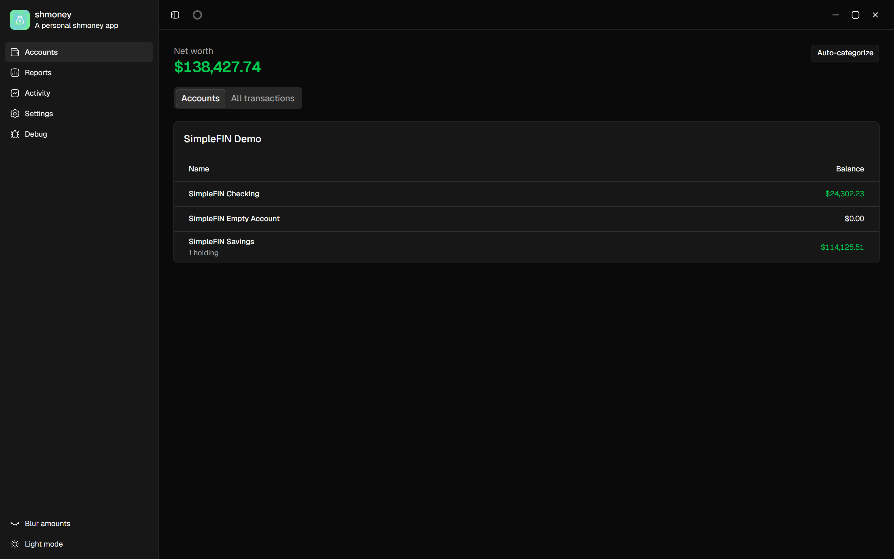
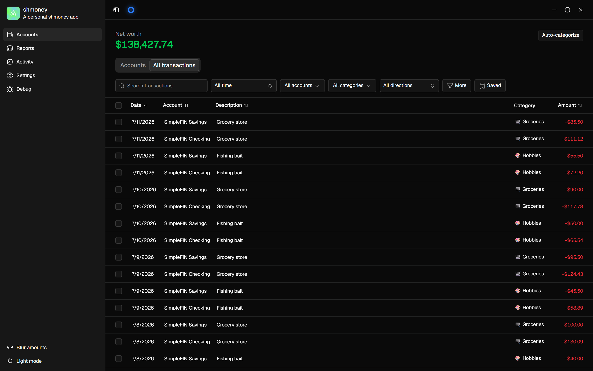
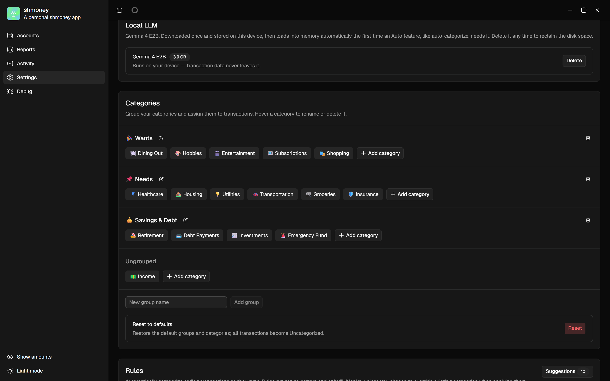
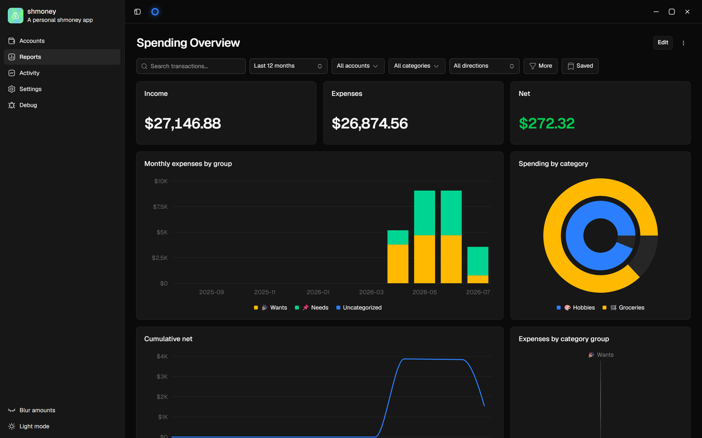
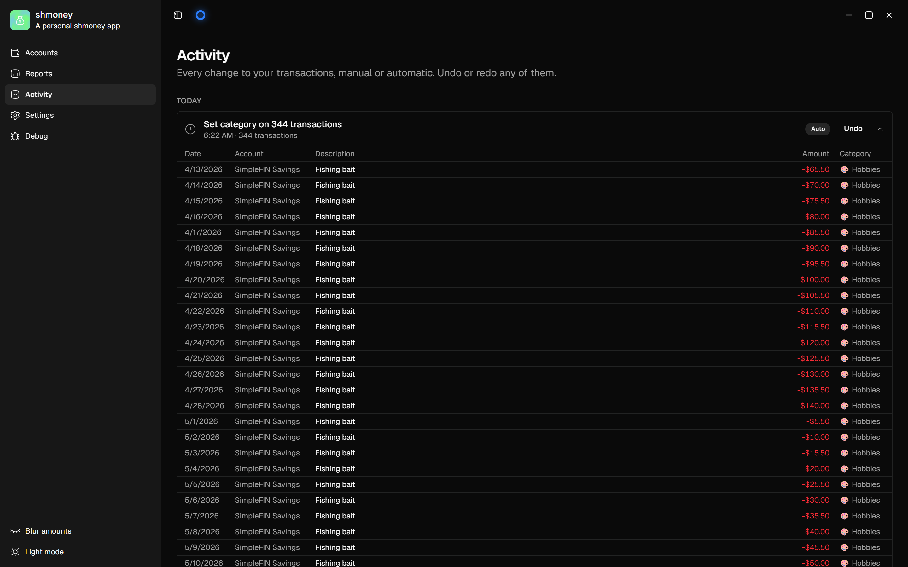

<div align="center">

# 💰 shmoney

**A local-first personal finance app. Your money, your rules, your machine.**

Track every account, categorize spending with an on-device AI, and build custom dashboards. All of it lives in a SQLite file on your computer. Nothing ever touches a cloud.




<sub>Screenshots show SimpleFIN demo data, synced and auto-categorized by the app itself.</sub>

</div>

---

## Why shmoney

Most finance apps want your bank credentials on their servers and your spending history in their analytics pipeline. shmoney takes the opposite bet:

- 🔒 **Local-first.** All data lives in a SQLite database on your device. No accounts, no telemetry, no cloud backend.
- 🔑 **Credentials encrypted at rest.** Bank access keys are sealed with your OS keychain via Electron `safeStorage` and never cross the process boundary.
- 🧠 **AI that stays home.** Auto-categorization runs a local LLM (Gemma 4 E2B via llama.cpp). Your transactions never leave the machine.
- ↩️ **Everything is undoable.** Every change, whether made by you, a rule, the transfer detector, or the AI, lands in an append-only action log you can review and reverse.

## Features

### 🏦 One-click bank sync

Connect once with a [SimpleFIN](https://www.simplefin.org/) token and pull balances, transactions, and investment holdings from every institution you use. Sync is idempotent and respectful: it never overwrites your categories, never resurrects deleted rows, and stores amounts as exact integer milliunits so the math is always right.

### 🧠 On-device AI categorization

Download the model once from Settings (about 4 GB) and hit Auto-categorize. Deterministic rules run first for free, then the LLM handles the leftovers. Output is grammar-constrained JSON, so the model can only ever answer with real category IDs. Identical merchants are batched into a single generation, and the whole run is cancellable and undoable.

<div align="center">

</div>

<div align="center">

</div>

### 📊 Dashboards you design

Reports are drag-and-drop grids of widgets: line, bar, area, pie, radar, stat tiles, summary tables, and transaction lists. Filter any report by date, account, category, direction, amount, or search text. Start from the Spending Overview template or build from scratch.

<div align="center">

</div>

### 🔁 Transfer detection

Money you move between your own accounts is not income or spending. shmoney pairs equal-and-opposite legs across accounts within a 3 day window and excludes them from every total. Only unambiguous 1:1 matches are marked, so your reports never get silently corrupted by a guess.

### ⚡ A rules engine that compiles to SQL

"If the description contains STARBUCKS, categorize as Dining Out." Rules match on description, amount, direction, account, and date, run in priority order on every sync, and each firing is individually undoable. shmoney even watches how you categorize and suggests new rules when it spots a pattern.

### 🕓 Full activity history

The Activity page is a flight recorder for your data. Every mutation is grouped by day, badged by its source (manual, rule, AI, detector), and reversible with one click, even across restarts.

<div align="center">

</div>

### And more

- 📈 **Investment holdings** synced per account with market value and cost basis
- 💵 **Net worth header** summed across every account, per currency
- 🙈 **Privacy blur** to hide all amounts when someone is looking over your shoulder
- 💾 **Saved filters** reusable across transaction views and reports
- 🌗 **Light and dark mode** with a polished shadcn/ui interface

## Getting started

### Prerequisites

- Node.js 20+
- A [SimpleFIN Bridge](https://beta-bridge.simplefin.org/) account to link your banks (optional, the app runs fine without it)

### Run it

```bash
git clone <this-repo>
cd shmoney
npm install
npm run dev
```

### Connect your banks

1. Grab a setup token from your SimpleFIN bridge
2. Open **Settings → SimpleFIN**, paste the token, and click **Connect**
3. Hit **Sync**. The first sync pulls about 90 days of history

### Enable AI categorization (optional)

Open **Settings → Local LLM** and click download. Once the model is on disk, the **Auto-categorize** button lights up everywhere. Delete the model any time to reclaim the space.

## Development

```bash
npm run dev          # run with hot reload
npm run test         # vitest unit tests
npm run typecheck    # node + web tsconfigs
npm run lint         # eslint, zero warnings allowed
npm run db:generate  # generate drizzle migrations from schema changes
npm run build:win    # package for Windows (also: build:mac, build:linux)
```

### How it is put together

| Layer | Tech |
| --- | --- |
| Shell | Electron 43 + electron-vite |
| UI | React 19, TypeScript, Tailwind CSS 4, shadcn/ui on Radix |
| Data fetching | TanStack Router, Query, and Table |
| Charts | Recharts + react-grid-layout dashboards |
| Storage | better-sqlite3 + Drizzle ORM, WAL mode, migrations bundled |
| AI | node-llama-cpp running Gemma 4 E2B in a utility process |
| Validation | Zod 4 at every IPC boundary |

The main process owns the database and all integrations; the renderer talks to it over typed, Zod-validated IPC. Pure logic like transfer pairing and rule matching lives in standalone unit-tested modules.

## Privacy model

| | |
| --- | --- |
| Your data | SQLite file in your OS user-data folder |
| Bank credentials | Encrypted with the OS keychain, never exported |
| Network calls | Your SimpleFIN bridge, plus a one-time model download |
| Telemetry | None |
| Cloud sync | None, by design |

---

<div align="center">
<sub>Built for people who think a bank statement is nobody's business but their own.</sub>
</div>
