

  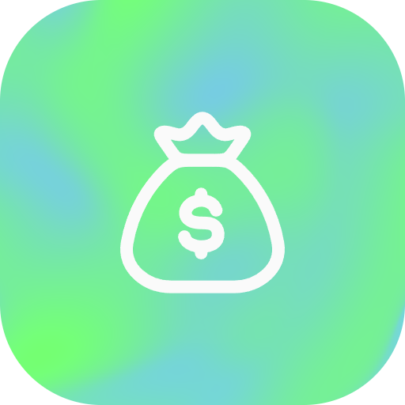

<h3 align="center" font=>shmoney</h3>
<h4 align="center" font=>Private first. Local first. Personal first.</h4>

 

  
  <picture><source media="(prefers-color-scheme: dark)" srcset="https://shieldcn.dev/badge/Gemma%204.svg?size=xs&amp;theme=blue&amp;font=geist&amp;logo=ri%3AFaGoogle&amp;logoColor=ffffff&amp;gap=7&amp;mode=dark"></picture>
  <picture><source media="(prefers-color-scheme: dark)" srcset="https://shieldcn.dev/badge/Secure%20&amp;%20Private.svg?size=xs&amp;theme=rose&amp;font=geist&amp;logo=lu%3ALock&amp;logoColor=ffffff&amp;gap=8&amp;mode=dark"></picture>

  
  
  

  <a href="https://github.com/rafeautie/shmoney/releases"><picture><source media="(prefers-color-scheme: dark)" srcset="https://shieldcn.dev/github/rafeautie/shmoney/release.svg?size=xs&amp;font=geist&amp;mode=dark;"></picture></a>
  <a href="https://github.com/rafeautie/shmoney/actions"><picture><source media="(prefers-color-scheme: dark)" srcset="https://shieldcn.dev/github/rafeautie/shmoney/ci.svg?size=xs&amp;font=geist&amp;mode=dark"></picture></a>

  <a href="https://rafe.dev/shmoney"><b>Try the live demo</b></a>

# shmoney

**Personal finance that never leaves your computer.** shmoney tracks your accounts, spending, budgets, goals, and investments in a single SQLite file on your own machine. No cloud backend, no account to sign up for, no telemetry. Even the AI runs on your device.

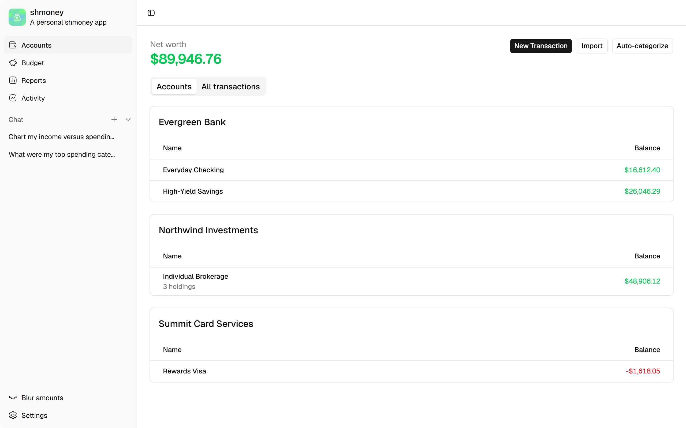

## Why shmoney

- **Your data stays yours.** Everything lives in one local database you can back up, move, or open with any SQLite tool.
- **AI without the cloud.** A local model categorizes transactions and answers questions about your money, fully offline.
- **Real bank data, no credential sharing.** Sync through [SimpleFIN](https://www.simplefin.org/) or import the files your bank already gives you.

## Features

### Every transaction, in one place

Sync balances, transactions, and holdings via SimpleFIN, or import CSV, TSV, OFX, QFX, and QIF with column mapping and duplicate detection. Transfers between your own accounts are detected automatically and kept out of income and spending.

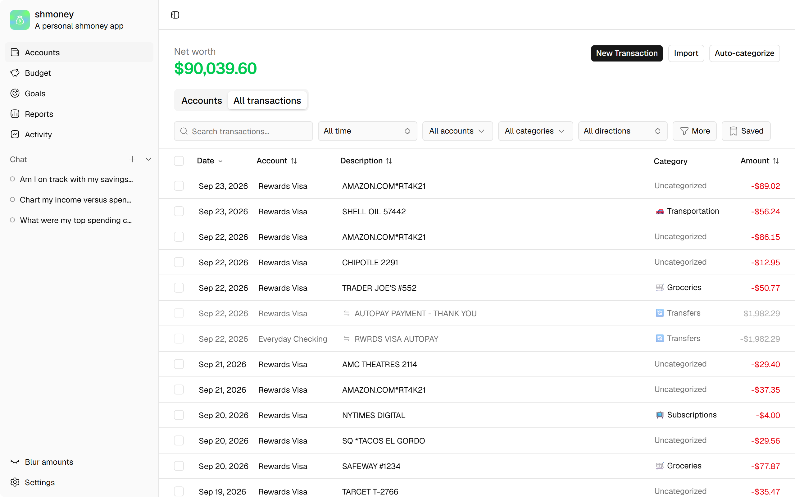

### Categorization that runs itself

Prioritized rules apply on every sync, and shmoney suggests new rules from how you categorize. Anything left over can go to an optional on-device model.

### Budgets and savings goals

Assign each month's money to category envelopes and watch what remains. Savings goals track a target balance or contributions across one or more accounts, with required monthly pace, projected finish date, and an On track / Behind status, all derived from your transactions rather than typed in.

<table>
  <tr>
    <td>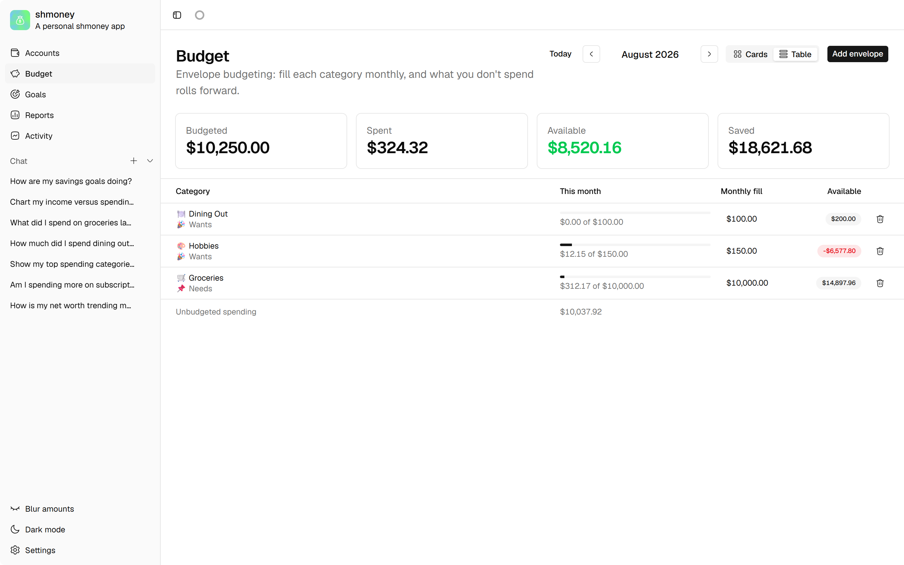</td>
    <td>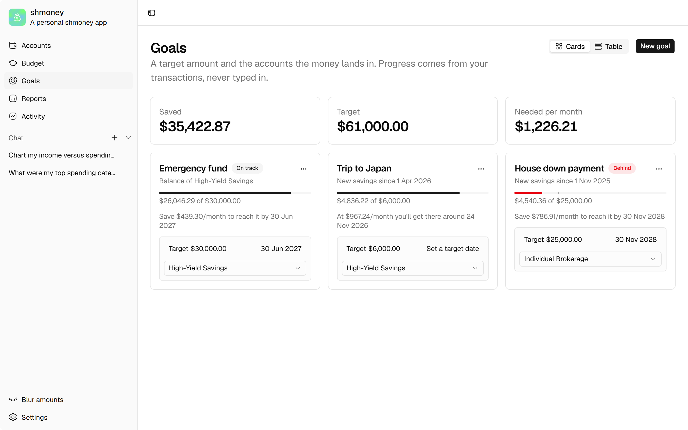</td>
  </tr>
</table>

### Reports you design

Build drag-and-drop dashboards from chart, table, and stat widgets with saved filters, or start from ready-made reports like Spending Overview and Savings Goals.

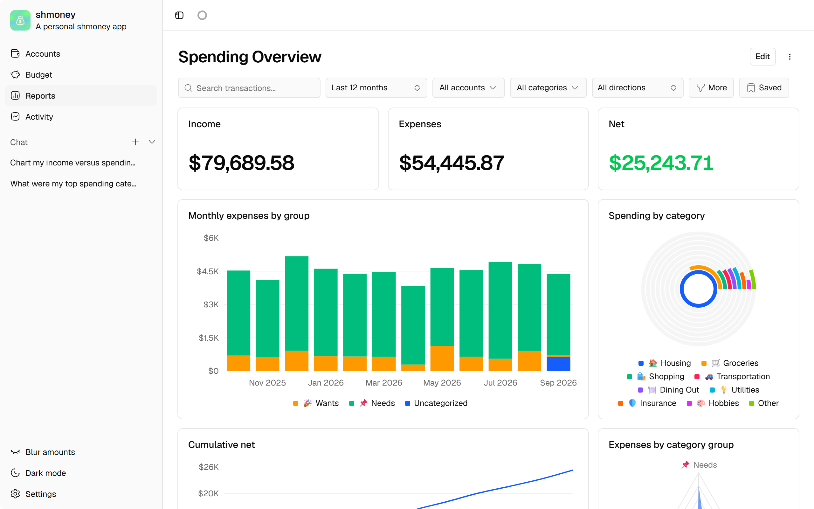

### Chat with your finances experimental

Ask plain-language questions and get answers with charts, optionally scoped to one account. The local model calls purpose-built tools that do the math in code, so the figures are exact rather than guessed:

- **Spending and income** by category, merchant, or period, with fair comparisons of this month against the last.
- **Budgets, goals, and balances**: what is left, what is on pace, and when you will reach a target.
- **Subscriptions and bills**, with the next charge date and any price increases.
- **What-if scenarios** like "what if I cut dining in half", including how the change moves a goal's finish date.
- **Anything unusual**: possible duplicate charges, new merchants, spending spikes, and goals falling behind.

Ask it to recategorize transactions, set a budget, or adjust a goal and it proposes the change as a card for you to apply, with undo. History is stored locally and nothing is sent anywhere.

<table>
  <tr>
    <td>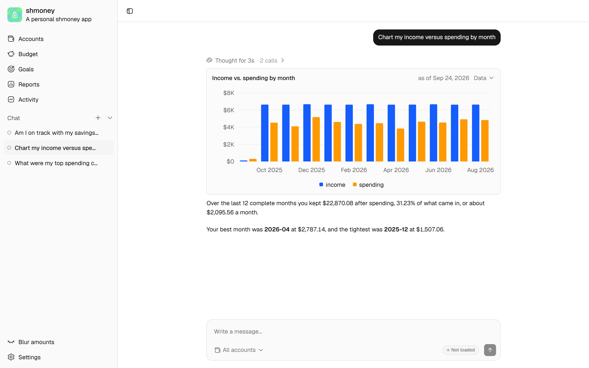</td>
    <td>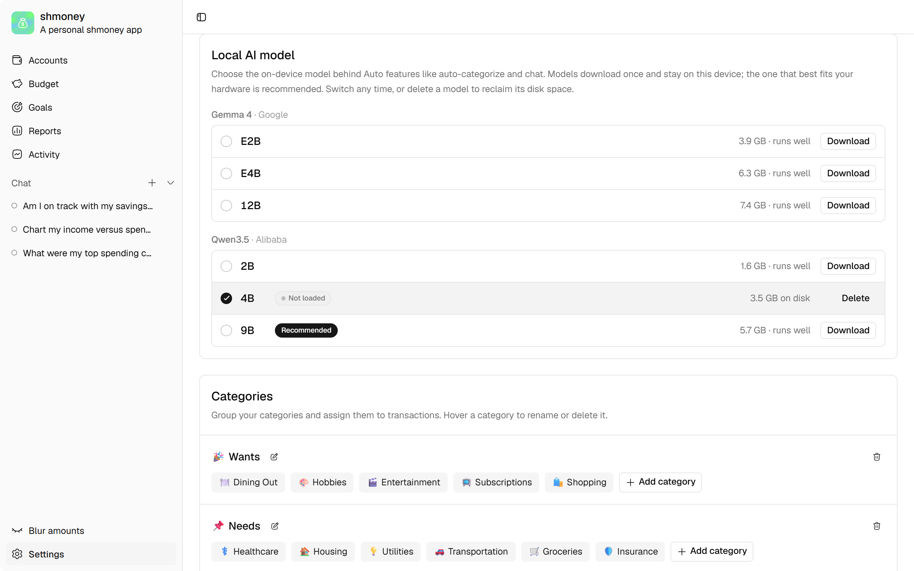</td>
  </tr>
</table>

### Undo anything

Every change is recorded in the Activity log and can be reversed, even after a restart.

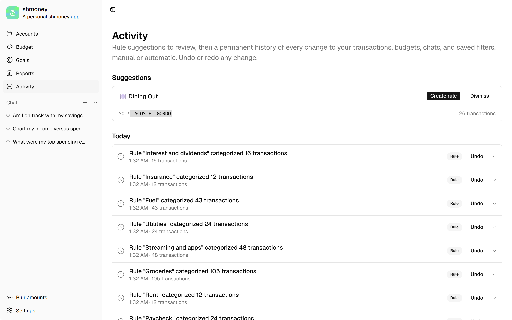

### Investments and net worth

Holdings with market value and cost basis, plus net worth broken out by currency.

More screenshots

 
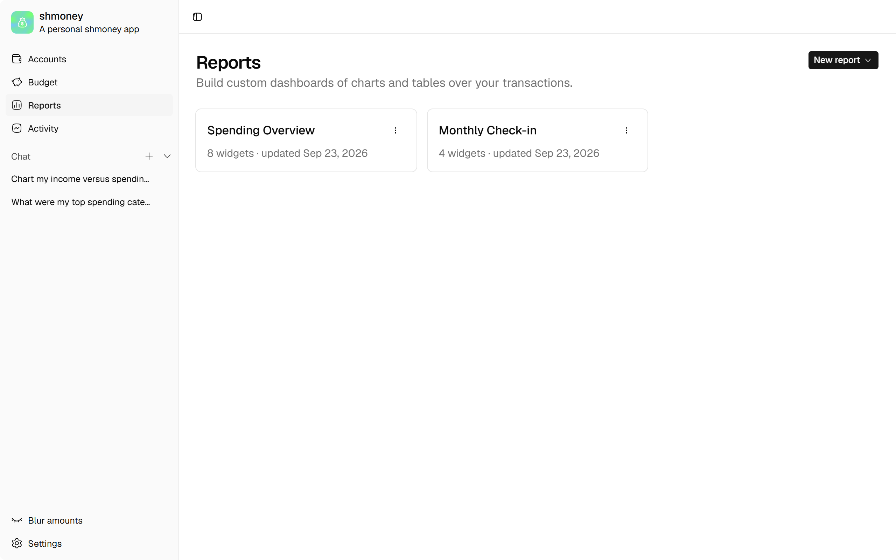
  
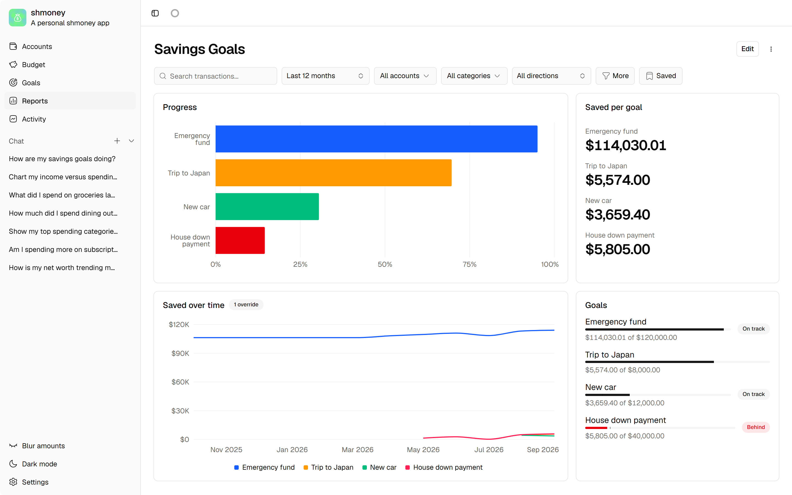

## Getting started

Download the latest build for Windows, macOS, or Linux from [Releases](https://github.com/rafeautie/shmoney/releases), or [try the live demo](https://rafe.dev/shmoney) with sample data first. Nothing in the demo is uploaded or saved.

**Coming soon:** European bank sync alongside SimpleFIN.

## Privacy

- Data lives in a SQLite file in your OS user-data directory.
- SimpleFIN credentials are encrypted with the OS keychain and never leave the Electron main process.
- The only network calls are to your SimpleFIN bridge and the one-time model download.

## Status

shmoney is under active development and has not reached a stable release; the database schema may change between versions.

## Contributing

Bug reports and feature requests are welcome via [GitHub issues](https://github.com/rafeautie/shmoney/issues); see [CONTRIBUTING.md](CONTRIBUTING.md). Pull requests are not accepted. Report security issues through [private vulnerability reporting](SECURITY.md).

## License

Source-available under the [PolyForm Noncommercial License 1.0.0](LICENSE.md): free to use, modify, and share for noncommercial purposes. For a commercial license, open an issue. The shmoney name and logo are not covered by the license; forks and derived works must use their own.
