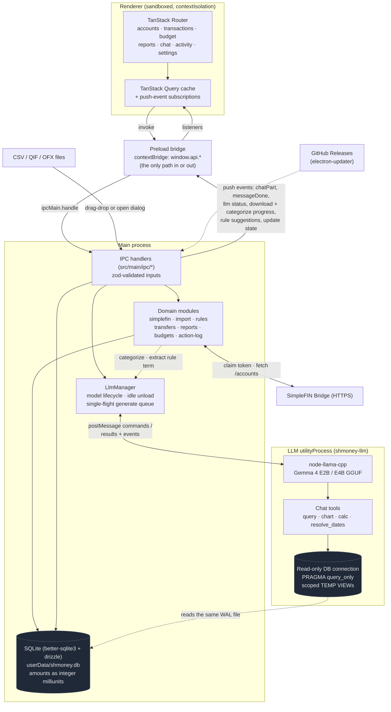
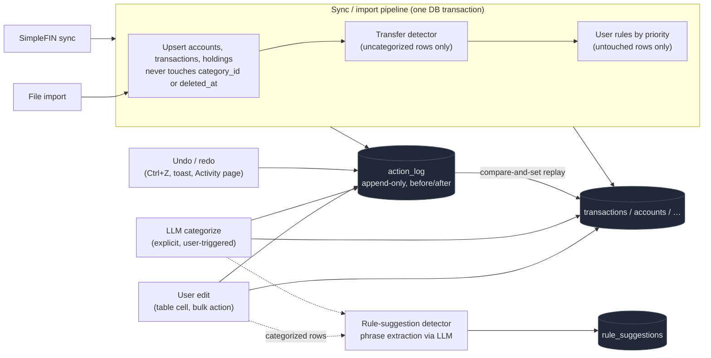
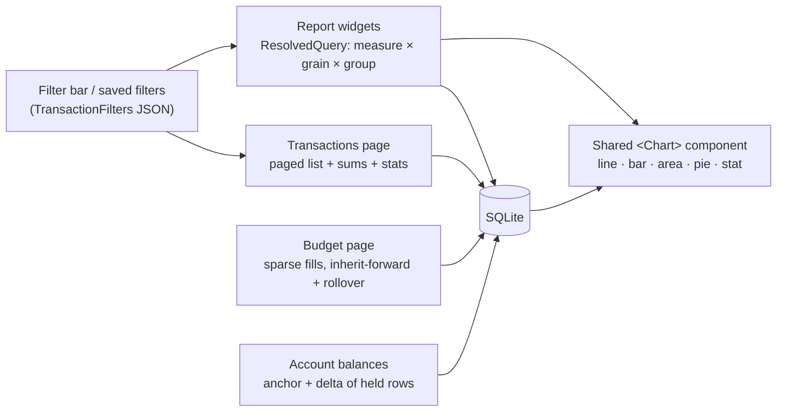
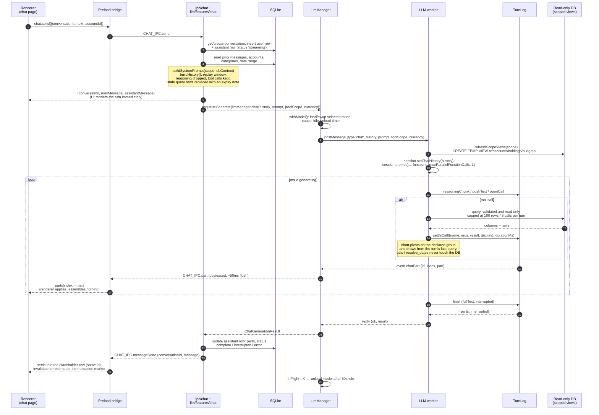
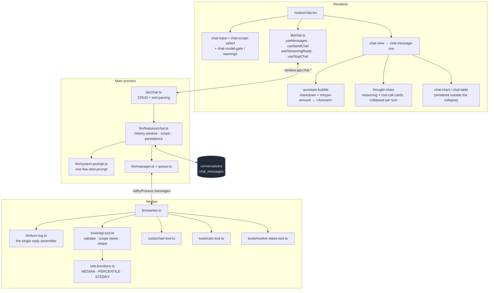
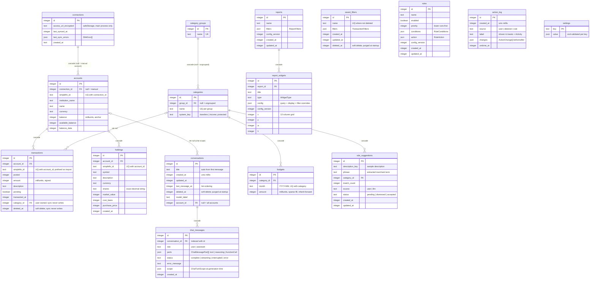

# shmoney architecture

Three views of the app, generated from the code as of 0.2.9:

1. [Data flow](#1-data-flow): the process boundaries and how data moves through them
2. [Chat feature](#2-chat-feature): one turn, end to end
3. [Database schema](#3-database-schema): tables and their relationships

## 1. Data flow

Three processes. The renderer never touches Node, SQLite, or the network; every
read and write crosses the preload bridge as an IPC call. The main process owns
the database. Inference runs in a separate `utilityProcess` so a heavy
generation or a llama.cpp crash cannot take down the UI.

### Write paths into the database

Every mutation, manual or automated, lands in `action_log` with before/after
values, which is what makes undo/redo survive restarts and gives the Activity
page its history.

### Read paths

## 2. Chat feature

One turn. The renderer sends text and gets an accepted-immediately response
(user row + a `streaming` placeholder assistant row); the reply itself arrives
as push events. The worker is **stateless across turns**; the main process
rebuilds the whole history from the database and hands it over on every send.

### Chat structure

## 3. Database schema

SQLite via drizzle. Money is stored as integer milliunits (`value * 1000`) so
SQL aggregates stay exact; timestamps are unix seconds except `action_log`,
`conversations`, and `chat_messages`, which use milliseconds. Deletes on
`transactions`, `saved_filters`, and `conversations` are soft.

`settings` has no foreign keys; it is the KV store for user preferences
(theme, privacy blur, `detectTransfers`, `applyRulesOnSync`, `selectedModel`,
sidebar state), validated per key with zod in the settings IPC handler.
