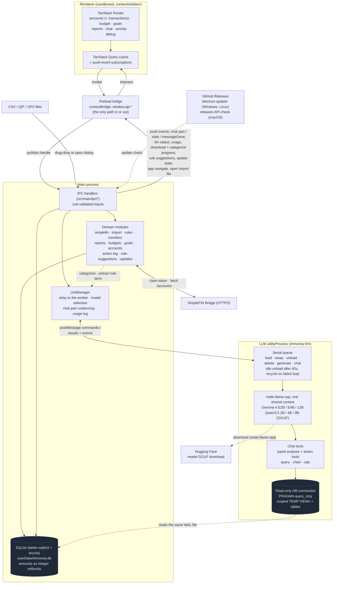
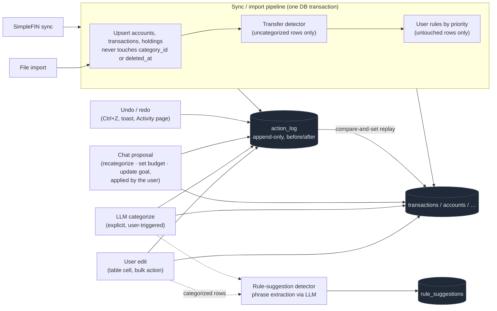
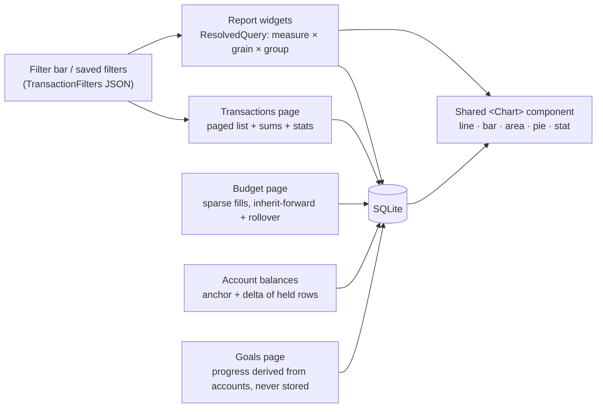
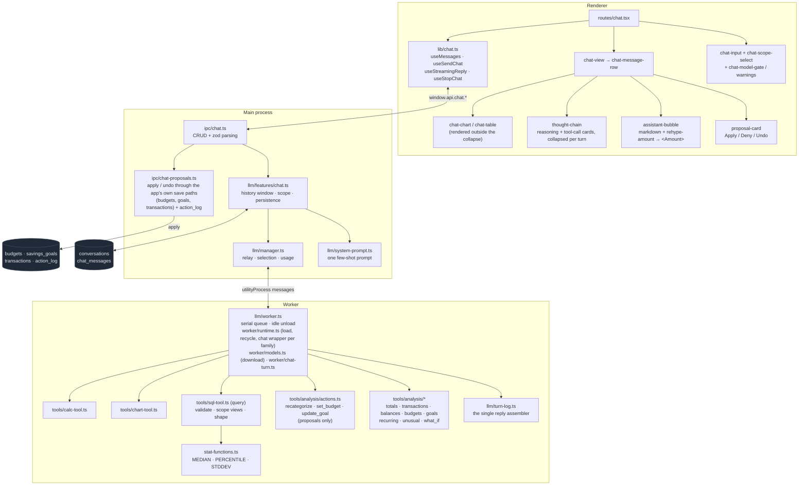

# shmoney architecture

Three views of the app, generated from the code as of 0.5.3:

1. [Data flow](#1-data-flow): the process boundaries and how data moves through them
2. [Chat feature](#2-chat-feature): one turn, end to end
3. [Database schema](#3-database-schema): tables and their relationships

## 1. Data flow

Three processes. The renderer never touches Node, SQLite, or the network; every
read and write crosses the preload bridge as an IPC call. The main process owns
the database. Inference runs in a separate `utilityProcess` so a heavy
generation or a llama.cpp crash cannot take down the UI. The worker owns the
model's whole lifecycle; the main process mostly relays.

```mermaid
flowchart TB
    subgraph renderer["Renderer (sandboxed, contextIsolation)"]
        direction TB
        router["TanStack Router<br/>accounts (+ transactions) · budget · goals<br/>reports · chat · activity · debug"]
        rquery["TanStack Query cache<br/>+ push-event subscriptions"]
        router --> rquery
    end

    bridge["Preload bridge<br/>contextBridge: window.api.*<br/>(the only path in or out)"]

    subgraph main["Main process"]
        direction TB
        ipc["IPC handlers (src/main/ipc/*)<br/>zod-validated inputs"]
        domain["Domain modules<br/>simplefin · import · rules · transfers<br/>reports · budgets · goals · accounts<br/>action-log · rule-suggestions · updates"]
        drizzle[("SQLite (better-sqlite3 + drizzle)<br/>userData/shmoney.db<br/>amounts as integer milliunits")]
        ipc --> domain --> drizzle
        ipc --> drizzle
        llmmgr["LlmManager<br/>relay to the worker · model selection<br/>chat part coalescing · usage log"]
        ipc --> llmmgr
        domain -.->|"categorize · extract rule term"| llmmgr
    end

    subgraph worker["LLM utilityProcess (shmoney-llm)"]
        direction TB
        queue["Serial queue<br/>load · swap · unload · delete · generate · chat<br/>idle unload after 60s, recycle on failed load"]
        llama["node-llama-cpp, one shared context<br/>Gemma 4 E2B / E4B / 12B<br/>Qwen3.5 2B / 4B / 9B (GGUF)"]
        tools["Chat tools<br/>typed analysis + action tools<br/>query · chart · calc"]
        readonly[("Read-only DB connection<br/>PRAGMA query_only<br/>scoped TEMP VIEWs + tables")]
        queue --> llama --> tools --> readonly
    end

    sfin["SimpleFIN Bridge (HTTPS)"]
    files["CSV / QIF / OFX files"]
    gh["GitHub Releases<br/>electron-updater (Windows, Linux)<br/>releases API check (macOS)"]
    hf["Hugging Face<br/>model GGUF download"]

    rquery -->|"invoke"| bridge
    bridge -->|"ipcMain.handle"| ipc
    ipc -->|"push events: chat part / stats / messageDone,<br/>llm status, usage, download + categorize progress,<br/>rule suggestions, update state,<br/>app navigate, open import file"| bridge
    bridge -->|"listeners"| rquery

    domain <-->|"claim token · fetch /accounts"| sfin
    files -->|"drag-drop or open dialog"| ipc
    gh -.->|"update check"| ipc
    llama -.->|"download (node-llama-cpp)"| hf

    llmmgr <-->|"postMessage commands /<br/>results + events"| queue
    readonly -.->|"reads the same WAL file"| drizzle

    classDef store fill:#1f2937,stroke:#4b5563,color:#e5e7eb
    class drizzle,readonly store
```

### Write paths into the database

Every mutation, manual or automated, lands in `action_log` with before/after
values, which is what makes undo/redo survive restarts and gives the Activity
page its history. A sync, import, Apply rules, or AI categorize writes many
entries; they share one `action_runs` row so Activity groups and undoes them
together.

```mermaid
flowchart LR
    user["User edit<br/>(table cell, bulk action)"]
    sync["SimpleFIN sync"]
    imp["File import"]

    subgraph pipeline["Sync / import pipeline (one DB transaction)"]
        direction TB
        upsert["Upsert accounts, transactions, holdings<br/>never touches category_id or deleted_at"]
        detect["Transfer detector<br/>(uncategorized rows only)"]
        rules["User rules by priority<br/>(untouched rows only)"]
        upsert --> detect --> rules
    end

    llmcat["LLM categorize<br/>(explicit, user-triggered)"]
    proposal["Chat proposal<br/>(recategorize · set budget · update goal,<br/>applied by the user)"]
    suggest["Rule-suggestion detector<br/>phrase extraction via LLM"]

    log[("action_log<br/>append-only, before/after")]
    db[("transactions / accounts / …")]

    user --> db
    sync --> pipeline
    imp --> upsert
    pipeline --> db
    llmcat --> db
    proposal --> db
    user -.->|"categorized rows"| suggest
    llmcat -.-> suggest
    suggest --> sugtable[("rule_suggestions")]

    user --> log
    pipeline --> log
    llmcat --> log
    proposal --> log
    undo["Undo / redo<br/>(Ctrl+Z, toast, Activity page)"] --> log
    log -->|"compare-and-set replay"| db

    classDef store fill:#1f2937,stroke:#4b5563,color:#e5e7eb
    class log,db,sugtable store
```

### Read paths

```mermaid
flowchart LR
    filters["Filter bar / saved filters<br/>(TransactionFilters JSON)"]
    txlist["Transactions page<br/>paged list + sums + stats"]
    reports["Report widgets<br/>ResolvedQuery: measure × grain × group"]
    budget["Budget page<br/>sparse fills, inherit-forward + rollover"]
    balances["Account balances<br/>anchor + delta of held rows"]
    goals["Goals page<br/>progress derived from accounts, never stored"]

    sql[("SQLite")]

    filters --> txlist --> sql
    filters --> reports --> sql
    budget --> sql
    balances --> sql
    goals --> sql
    sql --> chart["Shared &lt;Chart&gt; component<br/>line · bar · area · pie · stat"]
    reports --> chart
```

## 2. Chat feature

One turn. The renderer sends text and gets an accepted-immediately response
(user row + a `streaming` placeholder assistant row); the reply itself arrives
as push events. The worker is **stateless across turns**; the main process
rebuilds the whole history from the database and hands it over on every send.

```mermaid
sequenceDiagram
    autonumber
    participant UI as Renderer<br/>(chat page)
    participant BR as Preload bridge
    participant CH as ipc/chat +<br/>llm/features/chat
    participant DB as SQLite
    participant MG as LlmManager
    participant WK as LLM worker
    participant TL as TurnLog
    participant TDB as Read-only DB<br/>(scoped views)

    UI->>BR: chat.send({conversationId, text, accountId})
    BR->>CH: CHAT_IPC.send
    CH->>DB: get/create conversation, insert user row<br/>+ assistant row (status 'streaming')
    CH->>DB: read prior messages, accounts,<br/>categories, date range
    Note over CH: buildSystemPrompt(scope, dbContext)<br/>buildHistory(): every replayable row,<br/>reasoning dropped, tool calls kept,<br/>stale query rows replaced with an expiry note<br/>seed = last data call, rerun by the worker
    CH-->>UI: {conversation, userMessage, assistantMessage}<br/>(UI renders the turn immediately)

    CH->>MG: llmManager.chat(history, prompt, {toolScope, currency,<br/>goalRows, tools: vocab + goal pace + seed})
    MG->>WK: postMessage {type:'chat', modelId, history, prompt,<br/>toolScope, currency, goalRows, tools}
    WK->>WK: serial queue: wait for earlier requests,<br/>cancel idle-unload timer, load/swap modelId<br/>(chat wrapper per model family)
    WK->>TDB: refreshScopeViews(scope)<br/>CREATE TEMP VIEW tx/accounts/holdings/budgets/…<br/>+ goals / goal_history tables
    WK->>WK: fit history to the context (cut oldest turns),<br/>rerun the seed call, setChatHistory(history)<br/>session.prompt(..., functions, maxParallelFunctionCalls: 1)

    loop while generating
        WK->>TL: reasoningChunk / pushText / openCall
        alt tool call
            WK->>TDB: typed analysis tool or query,<br/>read-only, capped at 100 rows / 8 calls per turn
            TDB-->>WK: columns + rows
            WK->>TL: settleCall({name, args, result, display}, durationMs)
            Note over WK: typed tools return finished figures and a chart;<br/>chart draws from the turn's last data result<br/>and pivots on the declared group.<br/>calc never touches the DB.<br/>Action tools only propose; after one the turn only summarizes
        end
        TL-->>MG: event chatPart {id, index, part}<br/>(+ live stats snapshots)
        MG-->>BR: CHAT_IPC.part / stats (coalesced, ~50ms flush)
        BR-->>UI: parts[index] = part<br/>(renderer applies, assembles nothing)
    end

    WK->>TL: finish(fullText, interrupted)
    TL-->>WK: {parts, interrupted}
    WK-->>MG: final stats, then reply {ok, result}
    MG->>DB: llm_usage row (one per request)
    MG-->>CH: ChatGenerationResult
    CH->>DB: update assistant row: parts, stats, status<br/>complete / interrupted / error
    CH-->>BR: CHAT_IPC.messageDone {conversationId, message}
    BR-->>UI: settle into the placeholder row (same id),<br/>invalidate to recompute the truncation marker
    WK->>WK: queue drained → unload model after 60s idle<br/>(a failed load or dispose asks main to recycle the worker)
```

### Chat structure

```mermaid
flowchart TB
    subgraph rend["Renderer"]
        direction TB
        page["routes/chat.tsx"]
        input["chat-input + chat-scope-select<br/>+ chat-model-gate / warnings"]
        prop["proposal-card<br/>Apply / Deny / Undo"]
        view["chat-view → chat-message-row"]
        hooks["lib/chat.ts<br/>useMessages · useSendChat<br/>useStreamingReply · useStopChat"]
        page --> input
        page --> view
        page --> hooks
        view --> prop
        view --> bubble["assistant-bubble<br/>markdown + rehype-amount → &lt;Amount&gt;"]
        view --> chain["thought-chain<br/>reasoning + tool-call cards, collapsed per turn"]
        view --> cchart["chat-chart / chat-table<br/>(rendered outside the collapse)"]
    end

    subgraph mainp["Main process"]
        direction TB
        ipcchat["ipc/chat.ts<br/>CRUD + zod parsing"]
        props["ipc/chat-proposals.ts<br/>apply / undo through the app's own save paths<br/>(budgets, goals, transactions) + action_log"]
        feat["llm/features/chat.ts<br/>history window · scope · persistence"]
        prompt["llm/system-prompt.ts<br/>one few-shot prompt"]
        mgr["llm/manager.ts<br/>relay · selection · usage"]
        ipcchat --> feat --> prompt
        ipcchat --> props
        feat --> mgr
    end

    subgraph wk["Worker"]
        direction TB
        w["llm/worker.ts<br/>serial queue · idle unload<br/>worker/runtime.ts (load, recycle, chat wrapper per family)<br/>worker/models.ts (download) · worker/chat-turn.ts"]
        tl["llm/turn-log.ts<br/>the single reply assembler"]
        t0["tools/analysis/*<br/>totals · transactions · balances · budgets · goals<br/>recurring · unusual · what_if"]
        t0a["tools/analysis/actions.ts<br/>recategorize · set_budget · update_goal<br/>(proposals only)"]
        t1["tools/sql-tool.ts (query)<br/>validate · scope views · shape"]
        t2["tools/chart-tool.ts"]
        t3["tools/calc-tool.ts"]
        st["stat-functions.ts<br/>MEDIAN · PERCENTILE · STDDEV"]
        w --> tl
        w --> t0
        w --> t0a
        w --> t1 --> st
        w --> t2
        w --> t3
    end

    hooks <-->|"window.api.chat.*"| ipcchat
    mgr <-->|"utilityProcess messages"| w
    props -->|"apply"| actdb[("budgets · savings_goals<br/>transactions · action_log")]
    feat <--> convdb[("conversations<br/>chat_messages")]

    classDef store fill:#1f2937,stroke:#4b5563,color:#e5e7eb
    class convdb,actdb store
```

## 3. Database schema

SQLite via drizzle. Money is stored as integer milliunits (`value * 1000`) so
SQL aggregates stay exact; timestamps are unix seconds except `action_runs`,
`action_log`, `conversations`, `chat_messages`, and `llm_usage`, which use
milliseconds. Deletes on `transactions`, `saved_filters`, `savings_goals`,
and `conversations` are soft.

```mermaid
erDiagram
    connections ||--o{ accounts : "cascade (null = manual account)"
    accounts ||--o{ transactions : cascade
    accounts ||--o{ holdings : cascade
    accounts |o--o{ conversations : "set null (chat scope)"
    category_groups ||--o{ categories : "cascade (null = ungrouped)"
    categories |o--o{ transactions : "set null"
    categories ||--o{ budgets : cascade
    categories ||--o{ rule_suggestions : cascade
    action_runs |o--o{ action_log : "run_id (null = standalone)"
    action_log ||--o{ action_log_transactions : cascade
    savings_goals ||--o{ savings_goal_accounts : cascade
    accounts ||--o{ savings_goal_accounts : cascade
    reports ||--o{ report_widgets : cascade
    conversations ||--o{ chat_messages : cascade

    connections {
        integer id PK
        text access_url_encrypted "safeStorage, main process only"
        integer last_synced_at
        json last_sync_errors "SfinError[]"
        integer last_sync_failed_at "most recent sync that threw"
        text last_sync_failure "both null once a sync succeeds"
        text created_at
    }

    deleted_sync_accounts {
        text simplefin_id PK "sync skips these so deleted accounts stay gone"
    }

    accounts {
        integer id PK
        integer connection_id FK "null = manual"
        text simplefin_id "UQ with connection_id; null = created here"
        text institution_name
        text name
        text currency
        integer balance "milliunits, anchor"
        integer available_balance
        integer balance_date
    }

    holdings {
        integer id PK
        integer account_id FK
        text simplefin_id "UQ with account_id"
        text symbol
        text description
        text currency
        text shares "exact decimal string"
        integer market_value
        integer cost_basis
        integer purchase_price
        integer created_at
    }

    transactions {
        integer id PK
        integer account_id FK
        text simplefin_id "UQ with account_id; prefixed on import"
        integer posted
        integer amount "milliunits, signed"
        text description
        boolean pending
        integer transacted_at
        integer category_id FK "user-owned; sync never writes"
        integer deleted_at "soft delete; sync never writes"
        integer effective_date "generated, virtual: posted or transacted_at; indexed"
    }

    category_groups {
        integer id PK
        text name UK
    }

    categories {
        integer id PK
        integer group_id FK "null = ungrouped"
        text name "UQ per group"
        text system_key "transfers | income; UQ; protected"
    }

    budgets {
        integer id PK
        integer category_id FK
        text month "YYYY-MM, UQ with category"
        integer amount "milliunits, sparse fill, inherit-forward"
    }

    reports {
        integer id PK
        text name
        json filters "ReportFilters"
        integer config_version
        integer created_at
        integer updated_at
    }

    report_widgets {
        integer id PK
        integer report_id FK
        text title
        text type "WidgetType"
        json config "query + display + filter overrides"
        integer config_version
        integer x "12-column grid"
        integer y
        integer w
        integer h
    }

    saved_filters {
        integer id PK
        text name "UQ where not deleted"
        json filters "TransactionFilters"
        integer created_at
        integer updated_at
        integer deleted_at "soft delete; purged at startup"
    }

    savings_goals {
        integer id PK
        text name
        text mode "balance | contributions"
        integer target_amount "milliunits"
        text target_date "YYYY-MM-DD; compared in JS, never in SQL"
        integer started_at "rows count strictly after it"
        integer baseline_amount "pace line origin; never progress"
        text currency
        integer created_at
        integer updated_at
        integer archived_at
        integer deleted_at "soft delete; purged at startup"
    }

    savings_goal_accounts {
        integer goal_id PK "FK cascade"
        integer account_id PK "FK cascade"
    }

    rules {
        integer id PK
        text name
        boolean enabled
        integer priority "lower runs first"
        json conditions "RuleConditions"
        json action "RuleAction"
        integer config_version
        integer created_at
        integer updated_at
    }

    rule_suggestions {
        integer id PK
        text description_key "sample description"
        text phrase "extracted merchant term"
        integer category_id FK
        integer match_count
        text source "user | llm"
        text status "pending | dismissed | accepted"
        integer created_at
        integer updated_at
    }

    action_log {
        integer id PK
        integer created_at "unix millis"
        text source "user | rule | detector | llm | import"
        text label "shown in toasts + Activity"
        json changes "ActionChange[] before/after"
        integer undone_at
        integer run_id FK "null = standalone"
        text search_text "names + titles from changes, for Activity search"
    }

    action_runs {
        integer id PK
        integer created_at "unix millis"
        text trigger "sync | import | apply-rules | ai-categorize"
        text label
    }

    action_log_transactions {
        integer entry_id PK "FK cascade"
        integer transaction_id PK "no FK; a removed row stops matching"
    }

    conversations {
        integer id PK
        text title "auto from first message"
        integer created_at "unix millis"
        integer updated_at
        integer last_message_at "list ordering"
        integer deleted_at "soft delete; purged at startup"
        text model_label
        integer account_id FK "null = all accounts"
        integer seen_reply_id "newest reply the user has seen (unread dot)"
        integer truncated_before_id "oldest message the model saw; null = all fit"
    }

    chat_messages {
        integer id PK
        integer conversation_id FK "indexed with id"
        text role "user | assistant"
        json parts "ChatMessagePart[]: text | reasoning | functionCall (typed, action, query, chart, calc)"
        text status "complete | streaming | interrupted | error"
        text error_message
        json scope "ChatTurnScope at generation time"
        json stats "GenerationStats for the reply footer"
        integer created_at
    }

    llm_usage {
        integer id PK
        integer created_at "unix millis, request end"
        text model_id "text, survives model removal"
        text feature "LlmFeature"
        text stop_reason "GenerationStopReason"
        integer input_tokens
        integer output_tokens
        integer decode_tokens
        integer decode_ms
        integer prefill_ms
        integer tool_ms
        integer total_ms
        integer ttft_ms
        integer load_ms
    }

    settings {
        text key PK
        json value "zod-validated per key"
    }
```

`settings` has no foreign keys; it is the KV store for user preferences
(`theme`, `blurAmounts`, `sidebarOpen`, `windowState`, `nativeNotifications`,
`detectTransfers`, `applyRulesOnSync`, `ruleSuggestionsEnabled`,
`onboardingComplete`, `goalsView`, `budgetView`, activity and usage markers),
validated per key with zod in the settings IPC handler. `selectedModel` is
the exception: `LlmManager` reads and writes it directly, outside the zod
schema. `llm_usage` is never deleted; resetting usage moves the
`llmUsageSince` setting instead.
